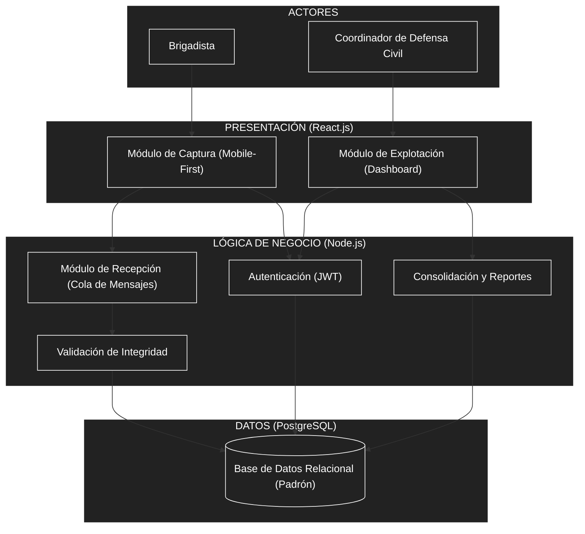

```mermaid
flowchart TD
    subgraph ACTORES ["ACTORES"]
        Brigadista["Brigadista"]
        Coordinador["Coordinador de Defensa Civil"]
    end

    subgraph PRESENTACION ["PRESENTACIÓN (React.js)"]
        Captura["Módulo de Captura (Mobile-First)"]
        Dashboard["Módulo de Explotación (Dashboard)"]
    end

    subgraph NEGOCIO ["LÓGICA DE NEGOCIO (Node.js)"]
        Auth["Autenticación (JWT)"]
        Recepcion["Módulo de Recepción (Cola de Mensajes)"]
        Validacion["Validación de Integridad"]
        Reportes["Consolidación y Reportes"]
    end

    subgraph DATOS ["DATOS (PostgreSQL)"]
        BD[("Base de Datos Relacional (Padrón)")]
    end

    Brigadista --> Captura
    Coordinador --> Dashboard

    Captura --> Auth
    Dashboard --> Auth
    
    Captura --> Recepcion
    Dashboard --> Reportes

    Recepcion --> Validacion
    Validacion --> BD
    Auth --> BD
    Reportes --> BD

    style ACTORES fill:#222,stroke:#fff,stroke-width:2px,color:#fff
    style PRESENTACION fill:#222,stroke:#fff,stroke-width:2px,color:#fff
    style NEGOCIO fill:#222,stroke:#fff,stroke-width:2px,color:#fff
    style DATOS fill:#222,stroke:#fff,stroke-width:2px,color:#fff
    style Brigadista fill:#222,stroke:#fff,color:#fff
    style Coordinador fill:#222,stroke:#fff,color:#fff
    style Captura fill:#222,stroke:#fff,color:#fff
    style Dashboard fill:#222,stroke:#fff,color:#fff
    style Auth fill:#222,stroke:#fff,color:#fff
    style Recepcion fill:#222,stroke:#fff,color:#fff
    style Validacion fill:#222,stroke:#fff,color:#fff
    style Reportes fill:#222,stroke:#fff,color:#fff
    style BD fill:#222,stroke:#fff,color:#fff
```